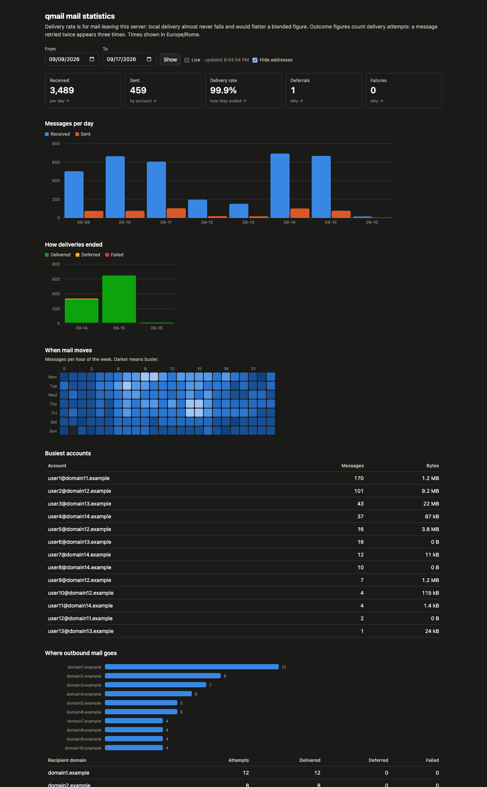
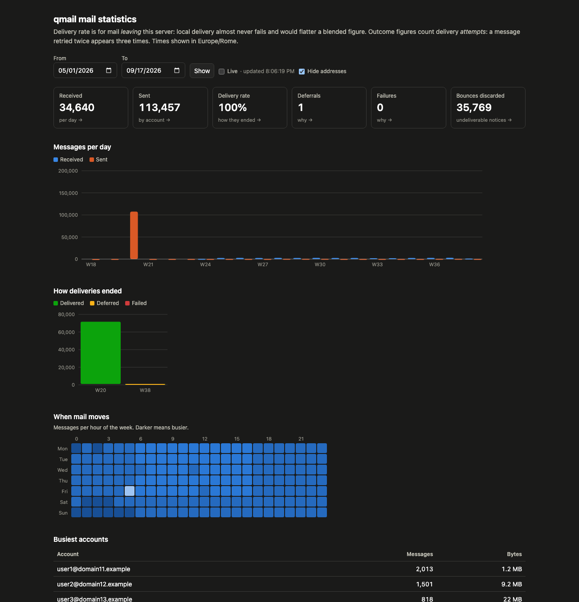

# qmail-grafical-stats

Mail statistics for qmail servers: volume, delivery rates, per-domain traffic,
and per-mailbox detail, read from the logs qmail already writes.

Reads `send`, `smtp`, `submission` and `smtps` multilog output, joins them on
the `qp` value they share, and stores one row per message and one row per
delivery attempt in MySQL. A small read-only web app serves the dashboard.

## Why not qmailmrtg7

[qmailmrtg7](https://www.inter7.com/qmailmrtg7-traffic-graphing/) has graphed
these logs since the MRTG era and still works. This covers the same volume and
delivery figures, and adds the questions RRD counters structurally cannot
answer — which account sent that mail, which domains it went to, what one
mailbox did last week — because it keeps rows rather than pre-aggregated
counters.

No code is derived from qmailmrtg7. Only the log formats are shared, and those
belong to qmail.



*Real traffic from a production mail server. Addresses are replaced by the
page's own "Hide addresses" switch, which is also how you take a screenshot of
your own: the figures and the relationships stay real, the identities do not.*



*The same server over five months. The spike is a backscatter incident: for
half an hour the server generated tens of thousands of bounces that were
themselves undeliverable. They are counted as bounces discarded rather than as
failed delivery, because they are the server throwing away undeliverable
notices, not mail failing to reach anyone -- which is why the delivery rate
beside them still reads 100%.*

## Status

Running in production. The parser reads five months of logs without a
malformed line, and the figures below are what it found there.

## Requirements

qmail with multilog logging, tcpserver, Python 3.6+, PyMySQL, MySQL 8 or
MariaDB 10.5+.

The authenticated-sender attribution relies on `policy_check` lines, which come
from a patched qmail-smtpd. Without them, outbound mail is attributed to the
envelope sender instead.

## Naming

The project is `qmail-grafical-stats`; the Python package inside it is
`qmailstats`, because package names cannot carry a hyphen and the shorter form
is what you type at an import.

## Contributing

Issues and patches welcome. The test suite runs without a database — the parser
tests need nothing but Python — and the database tests skip unless
`QMAILSTATS_TEST_DSN` points at a throwaway MySQL:

```
python3 -m venv .venv && .venv/bin/pip install pymysql pytest
.venv/bin/pytest
```

Report problems through the repository's issue tracker rather than by mail.

## License

Apache License 2.0. See `LICENSE` and `NOTICE`.
